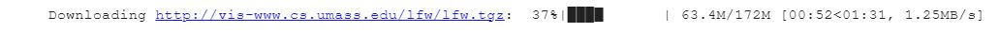
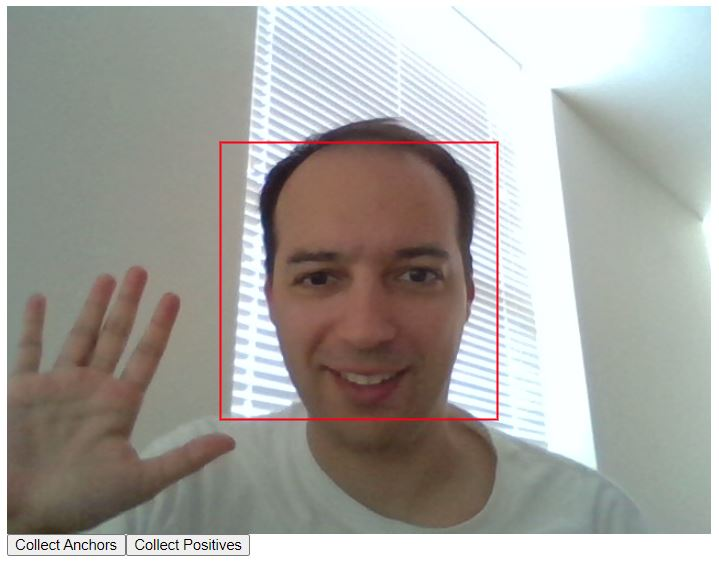
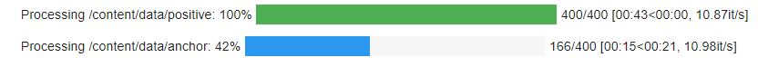
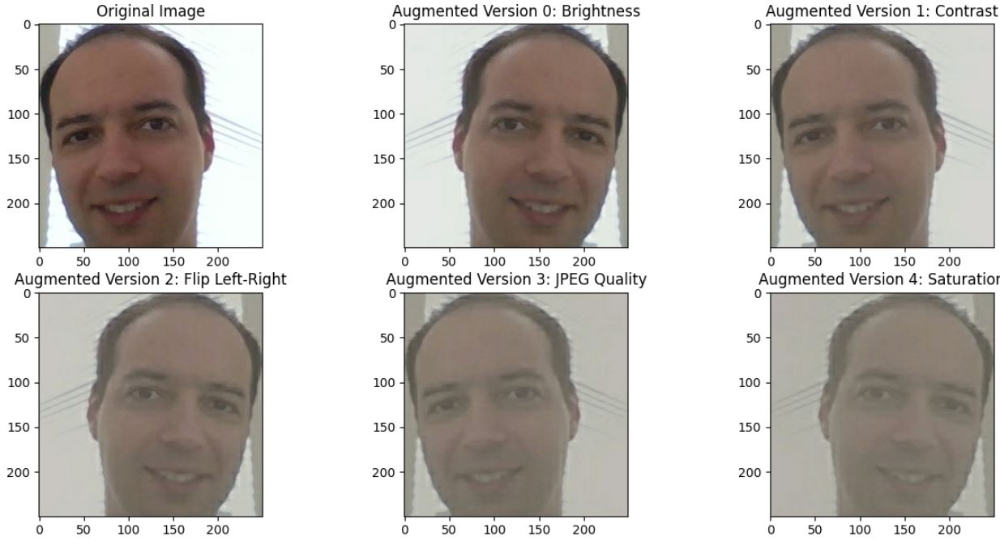
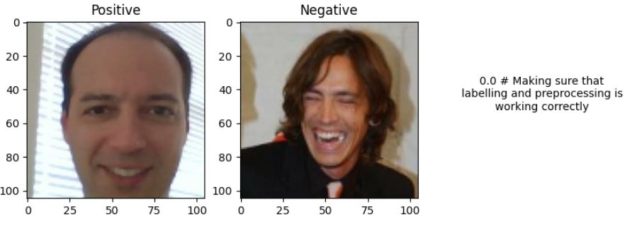
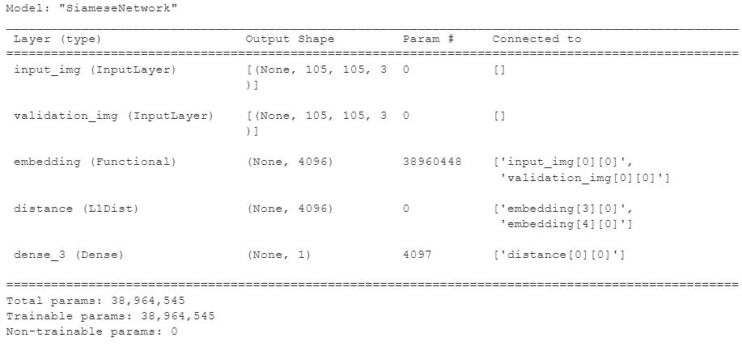
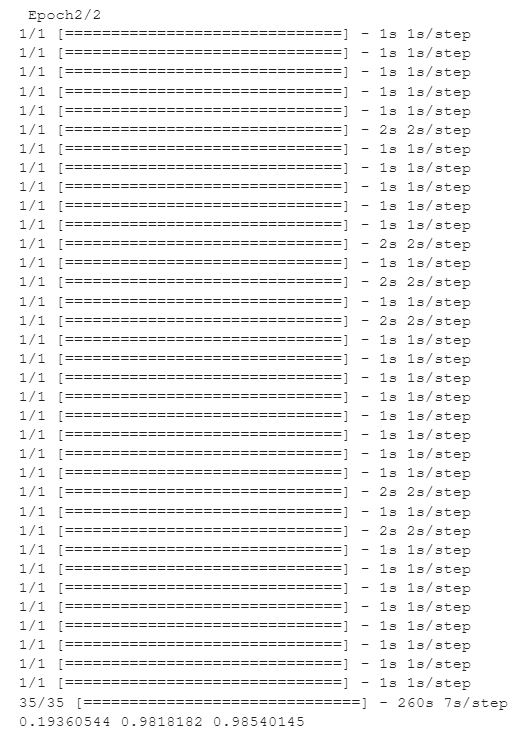
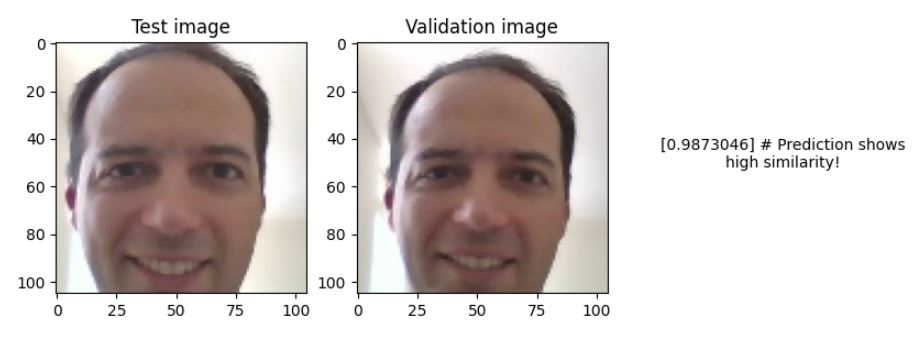
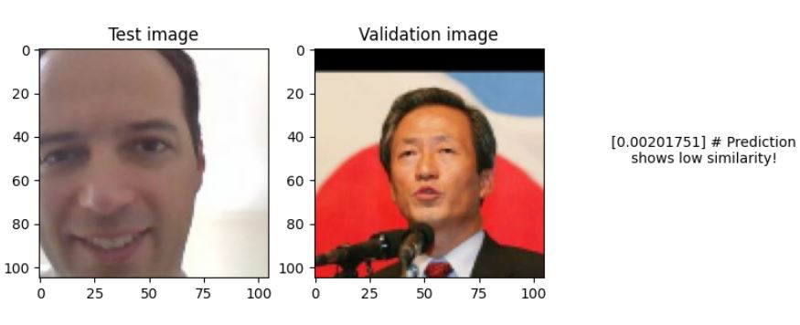

## Facial Verification with a Siamese Network

**Project description:** This facial verification app utilizes a Siamese network to verify images against an anchor image. Developed in Google Colab and employing TensorFlow, Keras, OpenCV-Python, Matplotlib, and tqdm, the app builds on the innovative methodology outlined in a scientific paper.

### 1. Automatic Creation of Folder Structures

A well-organized folder structure is automatically generated to streamline the handling of different data types, including positive images, negative images, and anchor images. This enhances the maintainability and scalability of the project.

### 2. Download and Uncompress Negative Images

The negative images essential for training are automatically downloaded and uncompressed from [UMass LFW dataset](http://vis-www.cs.umass.edu/lfw/lfw.tgz). This automation speeds up the data preparation phase.

### 3. Javascript for Collecting Positives and Anchors

A custom JavaScript code is utilized to collect 400 images comprising positives and anchors. This tailored approach ensures that the data collection process is precisely aligned with the project's unique requirements.

### 4. Data Augmentation

Data augmentation techniques are applied to amplify the initial collection ninefold. This enrichment strengthens the model's ability to generalize from the training data to unseen faces.

### 5. Load and Preprocess Images

Images are loaded and preprocessed using OpenCV-Python and other tools. The preprocessing includes normalization and other essential transformations to make the images suitable for training the Siamese network. A labeled dataset was created, grouping the images into categories based on distinct facial features or other relevant criteria.

### 6. Model Engineering as Specified in the Paper

[link](https://www.cs.cmu.edu/~rsalakhu/papers/oneshot1.pdf)

The app's architecture follows the specific guidelines and structure detailed in the referenced [scientific paper](https://www.cs.cmu.edu/~rsalakhu/papers/oneshot1.pdf). The use of TensorFlow and Keras libraries ensures a robust and flexible implementation.

### 7. Training with Binary Cross-Entropy and Adam Optimizer

Training is conducted using the binary cross-entropy loss function and the Adam optimizer. These choices reflect the binary nature of the verification task and the need for efficient optimization.

### 8. Precision, Recall, and Visual Results

#### Metrics
- **Loss (0.19360544):** This is a measure of how well the neural network is performing. It quantifies the difference between the predicted outputs and the true outputs for the data. A lower loss value indicates that the model's predictions are closer to the true values. The specific loss function used depends on the task and the implementation, and it could be something like mean squared error for regression or categorical crossentropy for classification.
- **Recall (0.9818182):** Recall is a metric used in classification to measure the proportion of actual positives that were identified correctly. In other words, out of all the positive samples, how many were correctly classified by the model? A recall of 1 would mean that all positive samples were correctly identified, while a recall of 0 would mean that no positive samples were correctly identified.
- **Precision (0.98540145):** Precision is another metric used in classification, and it measures the proportion of identified positives that were actually correct. In other words, out of all the samples that the model classified as positive, how many were actually positive? A precision of 1 would mean that all samples classified as positive were actually positive, while a precision of 0 would mean that none of the samples classified as positive were actually positive.

### 9. Saving Model

The trained Siamese network model is saved securely, enabling deployment and further refinement.

### 10. Building a Python App in Visual Studio Code

The project culminates in building a Python app using Visual Studio Code. This app integrates the trained model, offering a user-friendly interface for real-world facial verification.
